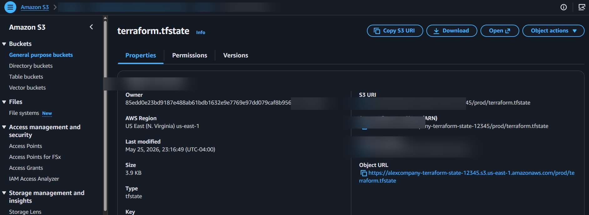
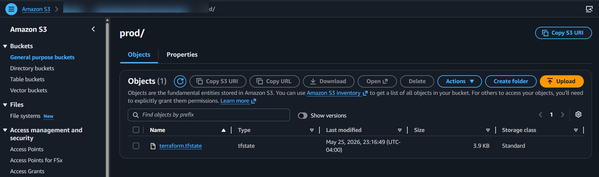
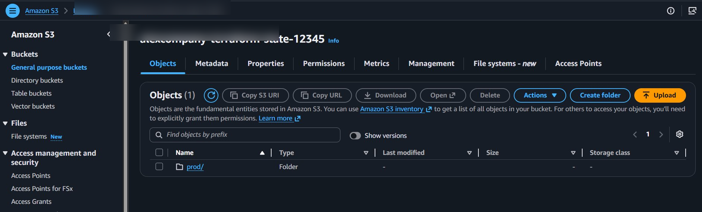
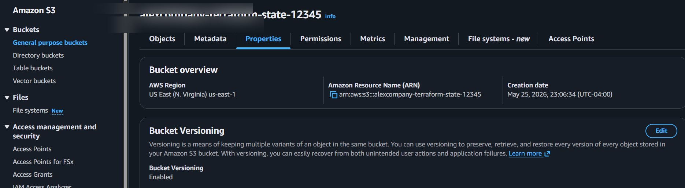
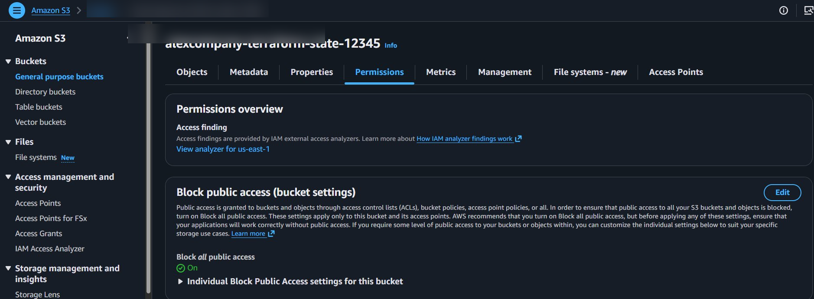

# Terraform AWS Infrastructure – Remote State Management with S3

This project demonstrates a production-style Terraform setup using **AWS S3 remote backend**, **Terraform state management**, **state locking**, **versioning**, and **validation** for safe team collaboration.

The goal is to prevent Terraform state corruption, support collaboration, and implement Infrastructure as Code (IaC) best practices.

---

# Architecture

```text
GitHub
   ↓
Terraform Code

AWS S3
   ↓
terraform.tfstate

State Locking
   ↓
Prevents concurrent execution

Versioning
   ↓
Recovery and rollback

Validation
   ↓
Input guardrails
```

---

# Project Structure

```text
terraform-aws-infra/
│
├── images/
│   ├── bucket-permissions.png
│   ├── bucket-versioning.png
│   ├── state-folder.png
│   ├── terraform-state-file.png
│   └── state-object-details.png
│
├── .gitignore
├── .terraform.lock.hcl
├── backend.tf
├── main.tf
├── outputs.tf
├── provider.tf
├── variables.tf
└── README.md
```

---

# Technologies Used

- Terraform
- AWS S3
- GitHub
- Terraform Backend
- Remote State
- State Locking
- Versioning
- Validation

---

# Terraform Remote Backend Configuration

File: `backend.tf`

```hcl
terraform {
  backend "s3" {
    bucket       = "alexcompany-terraform-state-12345"
    key          = "prod/terraform.tfstate"
    region       = "us-east-1"
    encrypt      = true
    use_lockfile = true
  }
}
```

This configuration provides:

✅ Remote Terraform state

✅ State locking

✅ Shared team collaboration

✅ Centralized state management

---

# Validation Implementation

File: `variables.tf`

Validation ensures Terraform receives valid inputs before deployment.

Example:

```hcl
variable "environment" {
  type = string

  validation {
    condition = contains(
      ["dev","qa","prod"],
      var.environment
    )

    error_message = "Environment must be dev, qa, or prod."
  }
}
```

Benefits:

- Prevents incorrect deployments
- Standardizes team inputs
- Improves collaboration
- Creates deployment guardrails

---

# AWS Implementation Screenshots

## S3 Bucket Security Configuration

Public access blocked:



---

## Bucket Versioning Enabled

Versioning supports backup and recovery:



---

## Terraform Remote State Folder

Remote state location:

```text
prod/
```



---

## Terraform State File

Remote Terraform state:

```text
terraform.tfstate
```



---

## Terraform State Object Details

Remote backend object details:



---

# Terraform Workflow

Initialize:

```bash
terraform init
```

Format:

```bash
terraform fmt
```

Validate:

```bash
terraform validate
```

Plan:

```bash
terraform plan \
-var="aws_region=us-east-1" \
-var="environment=dev" \
-var="instance_type=t3.micro"
```

Apply:

```bash
terraform apply \
-var="aws_region=us-east-1" \
-var="environment=dev" \
-var="instance_type=t3.micro"
```

---

# Team Collaboration Model

Without remote state:

```text
Engineer A → local terraform.tfstate
Engineer B → local terraform.tfstate
Engineer C → local terraform.tfstate
```

Risk:

❌ State drift

❌ Lost updates

❌ Corruption

❌ Conflicting changes

With remote state:

```text
AWS S3
   ↓
terraform.tfstate
   ↓
All engineers
```

Benefits:

✅ Shared state

✅ Locking

✅ Version recovery

✅ Team collaboration

---

# Outcome

Implemented:

✅ Terraform provisioning

✅ AWS S3 backend

✅ Remote state management

✅ State locking

✅ Versioning

✅ Validation

✅ Team collaboration workflow

✅ GitHub integration

---

Author: **Alexander Njoku**

GitHub: https://github.com/Alexjohn2023/terraform-aws-infra
